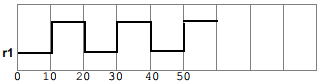

# 10. 赋值语句

- 目录

# 10.1 General概述

本条款描述了以下内容：

- 连续赋值
- 阻塞过程赋值语句和非阻塞过程赋值语句
- 过程连续赋值（assign、deassign、force、release）
- 网线取别名

# 10.2 Overview 概览

赋值是将值放入网线和变量的基本机制。目前有两种基本形式的赋值，如下：

- *连续赋值*，用于给网线或变量赋值
- *过程赋值*，用于给变量赋值

**连续赋值**驱动网线或变量的方式和门驱动网线或变量具有类似的方式。右侧表达式可以认为是一个连续驱动网线或变量的组合电路。相反，**过程式赋**值将值放入变量中。**赋值过程**没有时间区间概念，取而代之的是变量保持本次赋值的值直到下一次过程赋值赋予新值。

还存在另外两种赋值形式，`assign/deassign`和`force/release` ，这两种赋值形式叫做**过程连续赋值**，描述参见[10.6](https://www.notion.so/10-b9f83fc5f0c1468a9d7e1c566496306a?pvs=21)

一个赋值语句由两部分构成，左侧部分和右侧部分，由等号(=)分隔，在非阻塞过程赋值语句中，用小于等于号(<=)分隔。右侧部分可以是任何可以求值的表达式。左侧部分则表示网线或者变量，用于接受右侧的值。左侧的格式可以是表10-1里的任何一种，取决于赋值是**连续赋值**还是**过程赋值.**

Table 10-1—赋值语句中合法的左侧格式

| 语句类型 | 左侧格式 |
| --- | --- |
| 连续赋值 | 网线或变量（数组或标量）
网线数组或变量包的某1位(bit-select)
网线数组或变量包的部分位(part-select)
以上左侧形式任意一个的串联或嵌套串联 |
| 过程赋值 | 变量（数组或标量）
一个变量包的某1位
一个变量包的部分位
内存字 memory word
数组
数组的一个元素
数组的切片
以上左侧形式任意一个的串联或嵌套 |

System Verilog允许在赋值语句里指定一个时间单位，就像下面这样：

```verilog
#1ns r = a;
r = #1ns a;
r <= #1ns a;
assign #2.5ns sum = a + b;
```

# 10.3 Continuous assignments 连续赋值语句

连续赋值语句将会把值赋予到网线或者变量上，同时支持数组（packed）和标量。这个赋值行为发生在任何右侧值变化的时候。连续赋值为组合逻辑建模提供了一种途径，而不需要指定内部门之间的内部连接信息。相反，模型通过逻辑表达式来驱动网线或变量。

连续赋值有两种形式：*网线声明赋值*（见[10.3.1](https://www.notion.so/10-b9f83fc5f0c1468a9d7e1c566496306a?pvs=21)）和*连续赋值语句*（见[10.3.2](https://www.notion.so/10-b9f83fc5f0c1468a9d7e1c566496306a?pvs=21)）

连续赋值的语法如Syntax10-1 

```verilog
net_declaration::= // from A.2.1.3
net_type [ drive_strength | charge_strength ] [ vectored | scalared ]
data_type_or_implicit [ delay3 ] list_of_net_decl_assignments ;
| net_type_identifier [ delay_control ]
list_of_net_decl_assignments ;
| interconnect implicit_data_type [ # delay_value ]
net_identifier { unpacked_dimension }
[ , net_identifier { unpacked_dimension }] ;
list_of_net_decl_assignments ::= net_decl_assignment { , net_decl_assignment } // from A.2.3
net_decl_assignment ::= net_identifier { unpacked_dimension } [ = expression ] // from A.2.4
continuous_assign ::= // from A.6.1
assign [ drive_strength ] [ delay3 ] list_of_net_assignments ;
| assign [ delay_control ] list_of_variable_assignments ;
list_of_net_assignments ::= net_assignment { , net_assignment }
list_of_variable_assignments ::= variable_assignment { , variable_assignment }
net_assignment ::= net_lvalue = expression
```

> net_declaration: `charge_strength`只能和关键字`trireg`一起使用。当使用了关键字`vectored`或`scalared`时，则必须出现至少一个packed维度。
> 

## 10.3.1 网线声明赋值

网线声明赋值允许在声明网线的语句里为网线连续赋值。

以下例子是一个网线声明赋值的格式：

```verilog
wire (strong1, pull0) mynet = enable;
```

由于一个网线只能被声明一次，所以一个网线只可以有一个网线声明赋值语句。这个和连续赋值语句正好相反。一个网线可以接受多个连续赋值形式的赋值。

一个interconnect网线（见6.6.8）不会有网线声明赋值。

## 10.3.2 连续赋值语句

连续赋值语句会在一个网线或变量类型连续的赋值。网线可能是显式声明的或者根据申明规则隐式声明的。变量则要在连续赋值语句之前显式声明。

网线或变量的赋值必须是连续的和自动的。换句话说，右侧表达式的任何变化都会改变左侧的值，整个右侧都必须被求值。如果新的值和原值不一样，则新值会被赋值给左侧。

网线可以被多个连续赋值语句驱动，或者通过一个混合的元输出，模块输出以及连续赋值驱动。变脸则只能被一个连续赋值或一个元输出或一个模块输出驱动。如果驱动变量的连续赋值或输出在声明里有初始化或者任何过程赋值，则是错误的。见6.5

对一个原子网线的连续赋值不能之驱动这个网线的一部分；整个**nettype**值会被驱动。因此，连续赋值的左侧如果是用户定义的nettype必须不能包含任何索引或选择操作。

例子1：为一个预先声明的net做连续赋值

```verilog
wire mynet;
assign (string1, pull0) mynet = enable;
```

例子2：在一个4比特加法器模块里对carry进行连续赋值。赋值不能直接网线的声明里指定，因为在左侧进行连接concatenation

```verilog
module adder (sum_out, carry_out, carry_in, ina, inb);
	output [3:0] sum_out;
	output carry_out;
	input [3:0] ina, inb;
	input carry_in;
	wire carry_out, carry_in;
	wire [3:0] sum_out, ina, inb;
	assign {carry_out, sum_out} = ina + inb + carry_in;
endmodule
```

例子3：以下例子描述了一个拥有16bit输出bus的模块。它选择了4个输入之一和选中的输出bus进行连接。

```verilog
module select_bus(busout, bus0, bus1, bus2, bus3, enable, s);
	parameter n = 16;
	parameter Zee = 16'bz;
	output [1:n] busout;
	input [1:n] bus0, bus1, bus2, bus3;
	input enable;
	input [1:2] s;
	tri [1:n] data; // net declaration
	// net declaration with continuous assignment
	tri [1:n] busout = enable ? data : Zee;
	// assignment statement with four continuous assignments
	assign
		data = (s == 0) ? bus0 : Zee,
		data = (s == 1) ? bus1 : Zee,
		data = (s == 2) ? bus2 : Zee,
		data = (s == 3) ? bus3 : Zee;
endmodule
```

在此示例的模拟过程中经历了以下事件序列:

1. `s`的值，一个bus选择器的输入值，在赋值语句里被检查。基于`s`的值，网线`data`接受来自4个输入bus中的一个的值
2. 网线data的设置触发了`busout`网线在声明中的连续赋值。如果设置了enable，`data`的内容会赋值给`busout`；如果`enable`是0，`Zee`的内容会赋值给`busout`

# 10.4 Procedural assignments 过程赋值

过程赋值只出现在过程中，例如`always`，`initial`（见9.2），`task`和`function` （见Clause 13），可以他把看作是“触发式”的赋值。当模拟中的执行流达到过程中的赋值时，触发器就会发生。是否到达赋值点可以通过条件语句控制。事件控制，延迟控制，if语句，case语句和循环语句都可以用来控制是否要执行赋值。Clause 12给出了详细信息和例子。

过程赋值的右侧可以是任何能被求值的表达式，但是，左侧表达式的值类型可能会限制右侧表达式的合法性。左侧必须是一个接受来自右侧赋值的变量。过程赋值的左侧可以是以下形式之一：

- 单一变量，如6.4章节中描述的
- 综合变量，如Clause 7中描述的
- packed数组的单个位、部分位以及切片
- unpacked数组的切片

System Verilog包含以下三种类型的过程赋值语句：

- 阻塞过程赋值语句（见10.4.1）
- 非阻塞过程赋值语句（见10.4.2）
- 赋值操作符（见11.4.1）

阻塞和非阻塞过程赋值语句在序列块中指定了不同的过程。

## 10.4.1 阻塞过程赋值

在一个序列块里，阻塞过程赋值会在其之后的语句之前被执行（见9.3.1）。在一个并行块中，阻塞过程赋值语句不能阻止其后面的语句执行。

Syntax 10-2给出了阻塞过程赋值语句的语法:

```verilog
blocking_assignment ::= // from A.6.3
variable_lvalue = delay_or_event_control expression
| nonrange_variable_lvalue = dynamic_array_new
| [ implicit_class_handle . | class_scope | package_scope ] hierarchical_variable_identifier
select = class_new
| operator_assignment
operator_assignment ::= variable_lvalue assignment_operator expression
assignment_operator ::=
= | += | -= | *= | /= | %= | &= | |= | ^= | <<= | >>= | <<<= | >>>=
```

在这个语法中，`variable_lvalue`是一个合法的赋值语句的数据类型，=是赋值操作符，`delay_or_event_control`是用于内存分配时序控制的可选参数（见9.4.5）。表达式的右侧值会赋值给左侧。如果`variable_lvalue`需要计算（evaluation），右侧会通过内存分配时序控制指定的时间进行计算。如果没有指定时序控制，则`variable_lvalue`和右侧表达式的计算顺序是不定的。见4.9.3

阻塞过程赋值里用到的=赋值操作符也用在**过程连续赋值**和**连续赋值**里。

以下例子展示了阻塞过程赋值：

```verilog
rega = 0;
rega[3] = 1; // a bit-select
rega[3:5] = 7; // a part-select
mema[address] = 8'hff; // assignment to a mem element
{carry, acc} = rega + regb; // a concatenation
```

额外的赋值操作符，例如+=，在11.4.1章节中有说明。

## 10.4.2 非阻塞过程赋值

非阻塞过程赋值允许在规划赋值时不阻塞过程流程。非阻塞过程赋值语句可以用在同时给多个变量赋值而不需要关心赋值顺序或者对彼此的依赖。

使用非阻塞过程赋值给自动变量赋值是非法的。

Syntax 10-3 给出了非阻塞过程赋值的语法：

```verilog
nonblocking_assignment ::= variable_lvalue <= [ delay_or_event_control ] expression // from A.6.3
```

在这个语法中，variable_lvalue是一个过程赋值语句合法的数据类型。<=是非阻塞赋值的操作符，`delay_or_event_control`是用于内存分配时序控制的可选参数（见9.4.5）。如果`variable_lvalue`需要一个计算（evaluation），右侧会通过内存分配时序控制指定的时间进行计算。如果没有指定时序控制，则`variable_lvalue`和右侧表达式的计算顺序是不定的。见4.9.4

非阻塞赋值操作符和”小于或等于”操作符是一样的。具体的解释由<=出现位置的上下文来决定。当<=用在一个表达式里，它就被解释为一个关系操作符；当它被用在一个非阻塞过程赋值里，它就被解释为一个赋值运算符。

非阻塞过程赋值会在两个步骤里被计算（参见Clause 4）.这两个步骤的例子如下：

```verilog
module evaluates (out);
	output out;
	logic a, b, c;
	initial begin
		a = 0;
		b = 1;
		c = 0;
	end
	always c = #5 ~c;
	always @(posedge c) begin
		a <= b; // evaluates, schedules,
		b <= a; // and executes in two steps
	end
endmodule
```

Step 1:

在c的上升沿，模拟器计算非阻塞赋值的右值，将新值的赋值安排在阻塞赋值更新事件NBA region（见4.5）的最后.

非阻塞赋值的改变安排在 time 5

a = 0

b = 1

Step 2: 

当模拟器激活非阻塞赋值更新事件时，模拟器对每个非阻塞赋值语句的左侧进行更新。

assignment values:

a = 1

b = 0

最后的时序步骤表示非阻塞赋值是在时序步骤里最后被执行的赋值——有一个例外：非阻塞赋值事件可以创建阻塞赋值事件。这些阻塞赋值事件会在非阻塞赋值事件被安排了以后被处理。

和阻塞赋值的事件（event）或延迟控制不同的是，非阻塞赋值不会阻塞处理流程。在一个befin-end块中，非阻塞赋值计算和规划赋值，但是不会阻塞子序列语句的执行

```verilog
module nonblock1;
	logic a, b, c, d, e, f;
	// blocking assignments
	initial begin
		a = #10 1; // a will be assigned 1 at time 10
		b = #2 0; // b will be assigned 0 at time 12
		c = #4 1; // c will be assigned 1 at time 16
	end
	// nonblocking assignments
	initial begin
		d <= #10 1; // d will be assigned 1 at time 10
		e <= #2 0; // e will be assigned 0 at time 2
		f <= #4 1; // f will be assigned 1 at time 4
	end
endmodule
```

<aside>
💡 修改安排在 time 2

e = 0

修改安排在 time 4

f = 1

修改安排在 time 10

d = 1

</aside>

在例子2中，模拟器为当前时间步骤结尾处计算和规划赋值可以用非阻塞过程赋值执行交换操作。

```verilog
module nonblock2;
	logic a, b;
	initial begin
		a = 0;
		b = 1;
		a <= b; // evaluates, schedules,
		b <= a; // and executes in two steps
	end
	initial begin
		$monitor ($time, ,"a = %b b = %b", a, b);
		#100 $finish;
	end
endmodule
```

Step 1：

模拟器在当前时序阶段的末尾做非阻塞赋值右值的计算和安排。

Step 2：

在当前时序阶段的末尾，模拟器更新了每个非阻塞赋值语句的左侧。

assignment values：

a = 1

b = 0

```verilog
module multiple;
	logic a;
	initial a = 1;
	// The assigned value of the variable is determinate
	initial begin
		a <= #4 0; // schedules a = 0 at time 4
		a <= #4 1; // schedules a = 1 at time 4
	end // At time 4, a = 1
endmodule
```

如果模拟器并行执行两个过程块，并且这些过程块里包含了对相同变量赋值的非阻塞赋值操作，那么变量的最终值是不确定的（indeterminate)。例如，一下例子里的`a`就是一个不确定值：

```verilog
module multiple2;
	logic a;
	initial a = 1;
	initial a <= #4 0; // schedules 0 at time 4
	initial a <= #4 1; // schedules 1 at time 4
	// At time 4, a = ??
	// The assigned value of the variable is indeterminate
endmodule
```

针对同一变量的两个非阻塞赋值位于不同的块中，这一事实本身并不足以使对变量的赋值顺序不确定。比如，在以下例子中，变量`a`的值在时间周期16的结尾处是确定的(determinate):

```verilog
module multiple3;
	logic a;
	initial #8 a <= #8 1; // executed at time 8;
	// schedules an update of 1 at time 16
	initial #12 a <= #4 0; // executed at time 12;
	// schedules an update of 0 at time 16
	// Because it is determinate that the update of a to the value 1
	// is scheduled before the update of a to the value 0,
	// then it is determinate that a will have the value 0
	// at the end of time slot 16.
endmodule
```

接下来的例子展示了i[0]的值是如何赋值给r1的，赋值的安排是如何发生在每个时序延迟之后的：

```verilog
module multiple4;
	logic r1;
	logic [2:0] i;
	initial begin
	// makes assignments to r1 without cancelling previous assignments
	for (i = 0; i <= 5; i++)
		r1 <= # (i*10) i[0];
	end
endmodule
```



# 10.5 Variable declaration assignment((variable initialization) 变量声明赋值（变量初始化）

不同于网线，一个变量不能将隐式连续赋值作为它的声明的一部分。变量声明里的赋值是变量的初始化而不是连续赋值。

变量的声明赋值是过程赋值里的特例，它将一个值赋值给变量。它允许在变量声明的语句里出现一个初始值（见6.8）。这个赋值没有持续时间，取而代之，变量维持这个值直到下一此对此变量进行赋值。

例子：

```verilog
wire w = vara & varb; // net with a continuous assignment
logic v = consta & constb; // variable with initialization
```

在一个静态变量声明里设置一个初始值（包含静态类成员）必须出现在任何`initial`或`always`流程开始之前。也见6.21

# 10.6 Procedural continuous assignments 过程连续赋值

过程连续赋值（使用关键字`assign`和`force`）是一个过程语句，它允许在变量或网线上通过表达式驱动。Syntax 10-4是这些语句的语法

```verilog
procedural_continuous_assignment ::= // from A.6.2
assign variable_assignment
| deassign variable_lvalue
| force variable_assignment
| force net_assignment
| release variable_lvalue
| release net_lvalue
variable_assignment ::= variable_lvalue = expression
net_assignment ::= net_lvalue = expression // from A.6.1
```

`assign`过程连续赋值和一个`force`语句的右侧可以是一个表达式。这个必须被作为一个连续赋值对待；也就是说，在右侧中如果有任何一个变量赋值变化了，在`assign`或`force`生效时，赋值需要重新计算。例如：

```verilog
force a = b + f(c);
```

## 10.6.1 assign和deassign过程语句

assign过程连续赋值语句会覆盖一个变量的所有过程赋值。deassign过程赋值语句会结束一个变量的过程连续赋值。变量的值会保持不变直到通过过程赋值或过程连续赋值对它赋值一个新值。assign和deassign过程赋值语句允许，例如：当clear或preset是启用时，在clock被抑制的地方，在一个D-type edge-triggered flip-flop上的asynchronous clear/preset 建模。

在assign语句的赋值左侧必须时一个单一变量的引用或者是一组变量的连接。它不能是一个变量的位选择或部分位。

如果关键字assign应用于一个已经有过程连续赋值的变量，那么这个新的过程连续赋值应该在进行新的过程连续赋值之前取消该变量的赋值。

下面的例子展示了assign和deassign过程语句在一个拥有clear和preset输入的D-type flip-flop的行为中的用法：

```verilog
module dff (q, d, clear, preset, clock);
	output q;
	input d, clear, preset, clock;
	logic q;
	always @(clear or preset)
		if (!clear)
			assign q = 0;
		else if (!preset)
			assign q = 1;
		else
			deassign q;
	always @(posedge clock)
		q = d;
endmodule
```

如果`clear`或者`preset`是低电位，那么输出q将持续保持相应的常量值，同时`clock`的上升沿（positive edge）不会影响到`q`。当`clear`和`preset`都是高电位时，`q`被取消赋值（deassign）。

<aside>
💡 NOTE:
标准制定委员会正在考虑弃用过程赋值和取消赋值结构，见附录C。

</aside>

## 10.6.2 force和release过程语句

force和release是过程连续赋值提供的另一种语句。这些语句的效果和assign-deassign具有相似的效果，但是一个force可以像对待变量一样作用在nets上。赋值的左侧可以是一个单一变量的引用，一个net，一个net向量的bit-select，一个net向量的part-select或者这些形式的连接。但是左侧不能是一个变量的bit-select或part-select，也不能是带有user-define nettype的net。一个force或release语句不能应用于一个通过混合连续赋值和过程赋值的变量。

一个force语句在执行release语句之前，会覆盖变量的过程赋值，连续赋值或assign过程连续赋值。在release之后，如果变量没有被连续赋值驱动也没有一个激活的assign过程连续赋值，那么这个变量将不会立刻改变其值并会保持它的值直到下一次过程赋值执行到了这个变量上。通过一个连续赋值或当前有一个激活的assign过程连续赋值驱动的变量的releasing将会重新建立赋值并在连续赋值规划区域里规划一个再计算。

一个作用再net上的force过程赋值语句会覆盖这个net的所有drivers——gate输出，module输出和连续赋值——直到一个release过程赋值语句在这个net上执行了。当release后，这个net会立即被这个net的drivers的确定值赋值。

例子：

```verilog
module test;
	logic a, b, c, d;
	wire e;
	and and1 (e, a, b, c);
	initial begin
		$monitor("%d d=%b,e=%b", $stime, d, e);
		assign d = a & b & c;
		a = 1;
		b = 0;
		c = 1;
		#10;
		force d = (a | b | c);
		force e = (a | b | c);
		#10;
		release d;
		release e;
		#10 $finish;
	end
endmodule
```

<aside>
💡 运行结果：

0 d=0,e=0

10 d=1,e=1

20 d=0,e=0

</aside>

在这个例中，通过 force 过程赋值语句强制其输出为其输入的互或（`ORed`）值， 与门实

例 `and1` 被“修补”成类似于 或门，值互与的 assign 过程赋值语句被“修补”成类似

于值互或（`ORed`）的赋值语句。

# 10.7 Assignment extension and truncation赋值的扩展和截断

赋值左侧的位宽构成了右侧表达式的上下文。

以下几个步骤是用来计算一个赋值的：

1. 通过标准表达式位宽判定规则决定左侧和右侧表达式的位宽（见11.8.1）
2. 当计算出来的右侧位宽比左侧少时，右侧的值需要补位到左侧位宽宽度。如果右侧位宽时无符号的，就根据11.6.1章节指定的规则进行补齐。如果右侧位宽是有符号的，则根据sign-extended规则扩展。
3. 如果左侧位宽小于右侧，则会发生截断，后续篇幅会讲到。

在一个赋值语句中，如果右侧表达式的位宽比左侧大，右侧表达式的MSBs（Most Significant Bit,在二进制数中属于最高有效位，MSB是最高加权位，与十进制数字中最左边的一位类似）将会被丢弃以匹配左侧表达式的位宽。在具体的实现中可以（但不是必须的）在赋值语句出现位宽不匹配或截断是报一个相关告警或错误。位宽的裁切可以用于明确显式修改位宽的意图（见6.24.1）。截断一个有符号表达式的符号位，有可能改变符号结果。

以下是一些赋值截断的例子：

例子1

```verilog
logic [5:0] a;
logic signed [4:0] b;
initial begin
	a = 8'hff; // After the assignment, a = 6'h3f
	b = 8'hff; // After the assignment, b = 5'h1f
end
```

例子2

```verilog
logic [0:5] a;
logic signed [0:4] b, c;
initial begin
	a = 8'sh8f; // After the assignment, a = 6'h0f
	b = 8'sh8f; // After the assignment, b = 5'h0f
	c = -113; // After the assignment, c = 15
	// 1000_1111 = (-'h71 = -113) truncates to ('h0F = 15)
end
```

例子3

```verilog
logic [7:0] a;
logic signed [7:0] b;
logic signed [5:0] c, d;
initial begin
	a = 8'hff;
	c = a; // After the assignment, c = 6'h3f
	b = -113;
	d = b; // After the assignment, d = 6'h0f
end
```

# 10.8 Assignment-like contexts类相似赋值的上下文

一个类相似赋值的上下文如下：

- 一个连续赋值或过程赋值
- 对于带有显式类型声明的参数：
    - 在module、interface或class里对参数值的赋值
    - 在一个module、interface或program的实例中对参数值的覆盖
    - 在class的实例中或一个class作用域里解析操作符的左侧对参数值的覆盖
- 将一个port连接到一个module、interface或program的input、output port上
- 将值传递到一个subroutine的output，input或inout port上
- 在一个function里的return语句
- 一个tagged union表达式
- 对于用在一个assignment-like上下文里的作为右侧的表达式：
    - 如果是一个带括号的表达式，则是括号内的表达式
    - 如果是mintypmax表达式，则认为是一个冒号分隔的表达式
    - 如果是一个条件操作符表达式，则是第二个和第三个操作数
- 赋值模式中的表达式与数据对象或数据值中的字段或元素之间的非默认对应关系

其他的上下文不应该被认为是一个类似赋值的上下文。特别是以下场景不能认为是类似赋值上下文：

- 一个静态造型 static cast
- 赋值模式中的表达式域数据对象或数据值中的字段或元素之间又默认对应关系
- 在module、interface或program声明中的端口表达式
- 将值传递到一个subroutine的ref port
- 在module、interface或program中一个端口连接到一个inout或ref port上

# 10.9 Assignment patterns赋值模式

赋值模式用于描述赋值给结构体的域和数组元素的模式。

一个赋值模式指定了一个表达式集合与域和数据对象中的元素或数据值之间的对应关系。一个赋值模式没有self-determined数据类型，但是可以用于在类似赋值上下文中的切片（见10.8）。一个赋值模式是通过花括号，键和表达式构成，同时有一个`’`单引号作为前缀。例如：

```verilog
var int A[N] = '{default:1};
var integer i = '{31:1, 23:1, 15:1, 8:1, default:0};
typedef struct {real r, th;} C;
var C x = '{th:PI/2.0, r:1.0};
var real y [0:1] = '{0.0, 1.1}, z [0:9] = '{default: 3.1416};
```

赋值模式也有不带键的形式，根据表达式出现的位置顺序即可标记出对应关系。例如：

```verilog
var int B[4] = '{a, b, c, d};
var C y = '{1.0, PI/2.0};
'{a, b, c, d} = B;
```

当赋值模式用在类似赋值上下文的左侧时，需要位置符号；

每个成员表达式应具有与赋值兼容的比特流数据类型，并具有与右侧相应元素的数据类型相同的比特位。

Syntax 10.5列出了赋值模式的语法：

<aside>
💡

assignment_pattern ::= // from A.6.7.1

'{ expression { , expression } }

| '{ structure_pattern_key : expression { , structure_pattern_key : expression } }

| '{ array_pattern_key : expression { , array_pattern_key : expression } }

| '{ constant_expression { expression { , expression } } }

structure_pattern_key ::= member_identifier | assignment_pattern_key

array_pattern_key ::= constant_expression | assignment_pattern_key

assignment_pattern_key ::= simple_type | default

assignment_pattern_expression ::=

[ assignment_pattern_expression_type ] assignment_pattern

assignment_pattern_expression_type ::=

ps_type_identifier

| ps_parameter_identifier

| integer_atom_type

| type_reference

constant_assignment_pattern_expression$^{32}$ ::= assignment_pattern_expression

32)  In a constant_assignment_pattern_expression, all member expressions shall be constant exp

</aside>

一个赋值模式可以用于构造或析构一个结构体或一个数组（以赋值模式表达式形式的数据类型的名字前缀）。不同于赋值模式，一个赋值模式表达式有一个self-determined的数据类型，并且不限于类似赋值上下文中的一侧，左右都可以。当赋值模式表达式在右侧表达式中使用时，如果它是使用赋值模式初始化的，它将产生一个数据类型的变量包含的值。

```verilog
typedef logic [1:0] [3:0] T;
shortint'({T'{1,2}, T'{3,4}}) // yields 16'sh1234
```

当在左侧表达式中使用赋值模式表达式时，应要求使用位置符号；每个成员表达式应具有与赋值兼容的比特流数据类型，并具有与赋值模式表达式数据类型中相应元素相同的比特位。如果右侧表达式具有 self-determined 的数据类型，则它应与赋值模式表达式的数据类型兼容，并具有相同的比特位。

```verilog
typedef byte U[3];
var U A = '{1, 2, 3};
var byte a, b, c;
U'{a, b, c} = A;
U'{c, a, b} = '{a+1, b+1, c+1};
```

赋值模式表达式不能用于在module、interface或program中的port表达式。

## 10.9.1 Array assignment patterns数组赋值模式

连接花括号用于构造和析构简单bit位的向量。一个类似的语法用于支持数组的创建和销毁。表达式元素必须和元素匹配，花括号应该于数组尺寸一致。每个表达式项应该是在一个赋值上下文中根据元素类型进行计算。换句话说，以下例子不会引起size告警：

```verilog
bit unpackedbits [1:0] = '{1,1}; // no size warning required as bit can be set to 1
int unpackedints [1:0] = '{1'b1, 1'b1}; // no size warning required as int can be set to 1'b1
```

一个类似于描述复制的语法在数组赋值模式里很好用。每个复制一定代表了一个完整的维度：

```verilog
unpackedbits = 1{2 {y}}; //same as '{y, y}
int n[1:2][1:3] = '{2{3{y}}}; // same as '{'{y, y, y}, '{y, y, y}}
```

System Verilog会在赋值上下文中判定花括号的上下文。

有时候，在给数组援助赋值时不用保持关注数组元素数量很有用：

```verilog
initial unpackedints = '{default:2}' //sets elements to value 2
```

对于数组结构，指定一个或多个匹配类型的key是很有用的，就像10.9.2里的结构体赋值模式

```verilog
struct {int a; time b;} abkey[1:0];
abkey = '{'{a:1. b:2ns}}, '{int:5, time:$time}};
```

以下是匹配的规则：

- 一个index : value为一个键元素索引的值。这个值在赋值上下文中计算出来给索引到的元素并且必须能够造型为其类型。如果在一个单数组模式表达式中对相同索引指定了多次值，则会报错。
- 对于type : value，如果数组的元素或其子数组的类型这个类型，那么每一个元素或子数组在没有通过索引键方式设置值的情况下将会设置值。值会造型成数组元素或子数组的类型。另外，如果数组是多维的，那么这个规则将会递归到每个子数组中。换句话说，如果该数组是一个数组结构，那么递归到每个元素数组时也会使用这些规则到赋值模式里。如果多个类型匹配了相同的元素，将使用最后一次的值。
- default : value应用于与索引或类型键不匹配的元素或子数组。如果元素或子数组的类型是简单比特向量类型，或匹配值的 self-determined 类型，或不是数组或者结构类型，则默认在元素或子数组的每个赋值的上下文中计算值，并应强制转换为元素或子数组的类型；否则，将生成错误。对于不匹配的子数组，类型和默认说明符将根据本小节中的规则递归应用于其每个元素或子数组。对于不匹配的结构体元素，类型和默认键将根据结构的规则应用于元素。

每个元素都必须被这些规则覆盖住。

如果类型key，default key，或者复制操作符用在一个表达式里带有副作用，则表达式的计算次数是未定义的。

## 10.9.2 Structure assignment patterns结构体赋值模式

一个结构体可以通过一个结构体赋值模式构造和析构，赋值模式通过使用花括号和逗号的成员表达式来搭建，遵循成员声明的顺序。复制操作符可以用于为成员设置具体数量的值。每个成员表达式必须在赋值上下文中被计算成结构体里对应成员的类型。它同样可以通过成员的名字进行构建。

```verilog
module mod1;
	typedef struct {
		int x;
		int y;
	} st;
	st s1;
	int k = 1;
	initial begin
		#1 s1 = '{1, 2+k}; // by position
		#1 $display( s1.x, s1.y);
		#1 s1 = '{x:2, y:3+k}; // by name
		#1 $display( s1.x, s1.y);
		#1 $finish;
	end
endmodule
```

有时候，在给结构体成员设置值的时候不去关心成员数量和名字是很有用的。这些都可以通过default关键字来完成：

```verilog
initial s1 = '{default:2}; // sets x and y to 2
```

也可以使用`'{member:value}`或`'{data_type: default_value}`语法：

```verilog
ab abkey[1:0] = '{'{a:1, b:1.0}, '{int:2, shortreal:2.0}};
```

在嵌套结构体或结构体里unpacked数组里的元素中使用default关键字：

```verilog
struct {
	int A;
	struct {
		int B, C;
	} BC1, BC2;
} ABC, DEF;
ABC = '{A:1, BC1:'{B:2, C:3}, BC2:'{B:4,C:5}};
DEF = '{default:10};
```

为了解决成员的不同类型问题，一个类型可以用作key。这个用法会覆盖这些成员的default类型：

```verilog
typedef struct {
	logic [7:0] a;
	bit b;
	bit signed [31:0] c;
	string s;
} sa;
sa s2;
initial s2 = '{int:1, default:0, string:""}; // set all to 0 except the array of bits to 1 and string to ""
```

类似地，一个单独的成员可以设置并覆盖通用default的类型：

```verilog
initial #10 s2 = '{default:'1, s : ""}; // set all to 1 except s to ""
```

花括号用在赋值上下文时，System Verilog会判定其上下文。

匹配规则如下：

- 一个member : value为结构体的命名成员指定一个显式的值。这个命名成员必须处于结构体的顶层里；一个同名成员处在其他子结构层级里，是不会被赋值的。指定的值必须能够造型成成员的类型并在赋值上下文中计算得出，否则会产生一个错误。
- type : value为结构体里每个类型匹配的域指定一个显式的值（见6.22.1）并且不会给按上面通过名字设置的域赋值。如果相同的类型键出现了多次，则使用最后一次的。值会在赋值上下文中计算出匹配的类型。
- default : value 应用于没有被成员名和类型匹配的成员。如果成员类型是一个简单bit向量类型，就匹配self-determined类型的值，或者如果不是数组或结构体类型，值就会在赋值上下文中计算出来给成员，并必须可以造型为成员的类型；其他情况则产生一个错误。对于没有匹配到的结构体成员，类型和default指定器规则会递归到每个子结构体的成员。对于没有匹配上的数组成员，类型和default键规则会应用到每个数组上

每个成员都必须被规则覆盖到。

如果类型键，default键，或复制操作符用在了一个带有副作用的表达式里，这个表达式被计算的次数是未定义的。

# 10.10 Unpacked array concatenation非压缩数组拼接

非压缩数组的拼接提供了一个灵活的方式通过元素集合和数组来组建一个非压缩数值。一个非压缩数组拼接可能作为源表达式出现在一个assignment-like上下文中，不能出现在其他上下文里。这样的assignment-like上下文的目标必须是一个数组，这个数组slowest-varying的维度必须是一个非压缩的确定大小的队列或动态维度。其他类型（包括关联数组）的目标都是非法的。

一个非压缩数组拼接必须写成逗号分隔的列表，通过花括号包围起来，可以有0个或多个元素项。如果列表没有元素项，那么拼接表示一个没有元素的空数组。否则，每个项应表示结果数组值的一个或多个元素，解释如下：

- self-determined 类型与目标数组的元素类型赋值兼容的组件应表示单个元素。
- self-determined 类型为非压缩数组的项，其最慢变化维度的元素类型与目标数组的元素类型赋值兼容，应代表该项中存在的元素数量，按从左到右的顺序排列，与它们在数组项本身中显示的顺序相同。
- 任何其他类型的组件或没有 self-determined 类型的项应是非法的，除非目标数组的元素是 event、 class、 interface class、 chandle 或 virtual interface 类型，字面量 null应为合法的。

通过这样表示的元素需要按照从左到右的顺序格式形成结果数组。如果结果数组的大小和固定大小目标的元素数量不一致，则会产生一个错误。如果大小超过有界队列的最大元素数，则应忽略超出目标上限的元素，并发出警告。

## 10.10.1 Unpacked array concatenations compared with array assignment patterns非压缩数组拼接于数组赋值模式的比较

数组赋值模式更有优势，它可以用来创建通过带有类型名前缀的self-determined类型赋值模式表达式。更胜至于，在赋值模式里的元素项可以通过像`'{ n{element} }`这样的语法来表示，并且能够使用`default : value`语法来做默认值。不过，数组赋值模式里的每个元素项必须要和目标数组里每个元素项的类型要对应相同。相比之下，非压缩数组拼接禁止复制，默认值和显式类型，但是它提供了额外灵活性，可以将元素组合成数组任意混合的元素和数组。在一些简单的用例里，两种形式都能达到相同效果，就像下面的例子：

```verilog
int A3[1:3];
A3 = {1, 2, 3}; // unpacked array concatenation: A3[1]=1, A3[2]=2, A3[3]=3
A3 = '{1, 2, 3}; // array assignment pattern: A3[1]=1, A3[2]=2, A3[3]=3
```

下面的例子说明了一些两者的不同：

```verilog
typedef int AI3[1:3];
AI3 A3;
int A9[1:9];
A3 = '{1, 2, 3};
A9 = '{3{A3}};                // illegal, A3 is wrong element type
A9 = '{A3, 4, 5, 6, 7, 8, 9}; // illegal, A3 is wrong element type
A9 = {A3, 4, 5, A3, 6};       // legal, gives A9='{1,2,3,4,5,1,2,3,6}
A9 = '{9{1}};                 // legal, gives A9='{1,1,1,1,1,1,1,1,1}
A9 = {9{1}};                  // illegal, no replication in unpacked array concatenation
A9 = {A3, {4,5,6,7,8,9} };    // illegal, {...} is not self-determined here
A9 = {A3, '{4,5,6,7,8,9} };   // illegal, '{...} is not self-determined
A9 = {A3, 4, AI3'{5, 6, 7}, 8, 9}; // legal, A9='{1,2,3,4,5,6,7,8,9}
```

非压缩数组拼接对于书写队列类型的值特别有用，展示的例子在章节7.10.4中

## 10.10.2 Relationship with other constructs that use concatenation syntax于使用拼接语法的其他构造的关系

带有花括号的拼接语法可用在其他System Verilog结构中，包含向量拼接和字符串拼接。这些拼接形式是self-determined类型的表达式，和没有self-determined类型的非压缩数组拼接不一样的是，它必须作为源表达式出现在assignment-like上下文里。如果拼接的花括号带着非压缩数组目标出现在assignment-like上下文里，它就明确的表示了一个非压缩数组拼接，必须符合10.10里的规则。否则，他们要根据11.4.12中的规则构成向量或字符串拼接。下面的例子说明了相同表达式在不同上下文里具有不同含义且不会产生歧义：

```verilog
string S, hello;
string SA[2];
byte B;
byte BA[2];
hello = "hello";
S = {hello, " world"};     // string concatenation: "hello world"
SA = {hello, " world"};    // array concatenation: SA[0]="hello", SA[1]=" world"
B = {4'h6, 4'hf};          // vector concatenation: B=8'h6f
BA = {4'h6, 4'hf};         // array concatenation: BA[0]=8'h06, BA[1]=8'h0f
```

## 10.10.3 Nesting of unpacked array concatenations非压缩数组拼接的嵌套

非压缩数组拼接里的每一个元素项都必须拥有一个self-determined类型（见10.10），但是非压缩数组拼接整体上是非self-determined类型的。因此，它必须一个非压缩数组拼接作为一个元素项出现在另一个非压缩数组拼接里是合法的。这个规则使得可以让一个向量或字符串拼接作为一个元素项出现在非压缩数组拼接里而不出现起义。下面的例子就是一个说明：

```verilog
string S1, S2;
typedef string T_SQ[$];
T_SQ SQ;
S1 = "S1";
S2 = "S2";
SQ = '{"element 0", "element 1"}; // assignment pattern, two strings
SQ = {S1, SQ, {"element 3 is ", S2} };
```

前面例子里的最后一行，外层的花括号对包裹了一个非压缩数组拼接，内层的花括号对包裹了一个字符串凭借，因此生成的字符串结果队列是：

```verilog
'{"S1", "element 0", "element 1", "element 3 is S2"}
```

如果非压缩数组拼接的第三个元素项被写成一个赋值模式表达式，那么它可以通过一个字符串数组替换。非压缩数组拼接在这个用例里依然是合法的，但是这样它的第三个元素项就会被当作是一个拥有两个字符串的数组，每一个都生成结果数组里的一个元素：

```verilog
SQ = {S1, SQ, T_SQ'{"element 3 is ", S2} };
// result: '{"S1", "element 0", "element 1", "element 3 is ", "S2"}
```

`default : items`作为例外，赋值模式或赋值模式表达式里的每个元素项都在assignment-like上下文中（见10.9）.因此，非压缩数组拼接可能会作为non-default元素项出现在一个赋值模式中。以下的例子使用了二维队列来生成一个整型的锯齿数组的数组，同时使用了赋值模式表达式和非压缩数组拼接来表示子数组：

```verilog
typedef int T_QI[$];
T_QI jagged_array[$] = '{ {1}, T_QI'{2,3,4}, {5,6} };
// jagged_array[0][0] = 1 -- jagged_array[0] is a queue of 1 int
// jagged_array[1][0] = 2 -- jagged_array[1] is a queue of 3 ints
// jagged_array[1][1] = 3
// jagged_array[1][2] = 4
// jagged_array[2][0] = 5 -- jagged_array[2] is a queue of 2 ints
// jagged_array[2][1] = 6
```

# 10.11 Net aliasing网线别名

一个别名语句为同一个物理网线或者网线里的bit位声明多个名字。别名语句的语法如下：

```verilog
net_alias ::= alias net_lvalue = net_lvalue { = net_lvalue } ; // from A.6.1
net_lvalue ::= // from A.8.5
ps_or_hierarchical_net_identifier constant_select
| { net_lvalue { , net_lvalue } }
| [ assignment_pattern_expression_type ] assignment_pattern_net_lvalue
```

连续赋值语句是一个单项赋值，它里面可以参杂一个延迟和一个强度变化。为了建模一个双向短路（short-circuit）连接，就需要用到别名语句。别名列表里的成员都是信号，这些信号的bit位都共享相同的物理网线。以下的例子实现了在bus A和bus B之间的一个字节序翻转：

```verilog
module byte_swap (inout wire [31:0] A, inout wire [31:0] B);
	alias {A[7:0],A[15:8],A[23:16],A[31:24]} = B;
endmodule
```

这个例子将LSB和MSB从一个4字节bus里剥离：

```verilog
module byte_rip (inout wire [31:0] W, inout wire [7:0] LSB, MSB);
	alias W[7:0] = LSB;
	alias W[31:24] = MSB;
endmodule
```

bit位覆盖的规则与具有相同成员类型的压缩联合体相同：每个成员必须是相同大小的，连接性对于模拟host是独立的。网线通过一个别名语句进行连接必须是类型兼容的，也就是说，他们具有相同的网线类型。举个例子，将一个wand网线和一个wor网线通过别名语句连接起来是合法的。这个规则比网线连接端口的规则更严苛，因为一个别名的作用域是限制了的，这些连接更像是一个设计错误。变量和层次引用不能用在别名语句中。任何违反这些规则的行为都将导致一个致命错误。

同一个网线可以出现在多个别名语句中。它的影响是累积的。下面两个例子是等价的，在每个用例里，`low12[11:4]` 和`high12[7:0]`都共享相同的连线。

```verilog
module overlap(inout wire [15:0] bus16, inout wire [11:0] low12, high12);
	alias bus16[11:0] = low12;
	alias bus16[15:4] = high12;
endmodule

module overlap(inout wire [15:0] bus16, inout wire [11:0] low12, high12);
	alias bus16 = {high12, low12[3:0]};
	alias high12[7:0] = low12[11:4];
endmodule
```

为了在详细说明里避免错误，从一个独立型号指定别名到自己或者多次指定相同别名多次都是不允许的。下面的代码就是非法的，因为前4bit位和后4bit位在语句里是相同的：

```verilog
alias bus16 = {high12[11:8], low12};
alias bus16 = {high12, low12[3:0]};
```

要强调的是，这样也是非法的，因为`bus16`的bit位被别名到了自己身上：

```verilog
alias bus16 = {high12, bus16[3:0]} = {bus16[15:12], low12};
```

别名语句可以出现在任何module instance语句可以出现的位置。在别名语句里，如果一个标识符没有被声明为一个数据类型，那么它会被隐式地假定成网线，遵循地规则和module instance地隐式网线一致。以下的例子创建了标准的宏元件，使用带有自动名字绑定到cell的pin别名：

```verilog
module lib1_dff(Reset, Clk, Data, Q, Q_Bar);
...
endmodule
module lib2_dff(reset, clock, data, q, qbar);
...
endmodule
module lib3_dff(RST, CLK, D, Q, Q_);
...
endmodule
module my_dff(rst, clk, d, q, q_bar); // wrapper cell
	input rst, clk, d;
	output q, q_bar;
	alias rst = Reset = reset = RST;
	alias clk = Clk = clock = CLK;
	alias d = Data = data = D;
	alias q = Q;
	alias Q_ = q_bar = Q_Bar = qbar;
	`LIB_DFF my_dff (.*); // LIB_DFF is any of lib1_dff, lib2_dff or lib3_dff
endmodule
```

在别名语句里使用一个网线不会改变网线在其他语句里的物理行为。取别名是在elaborate过程中施行的，不能被取消。